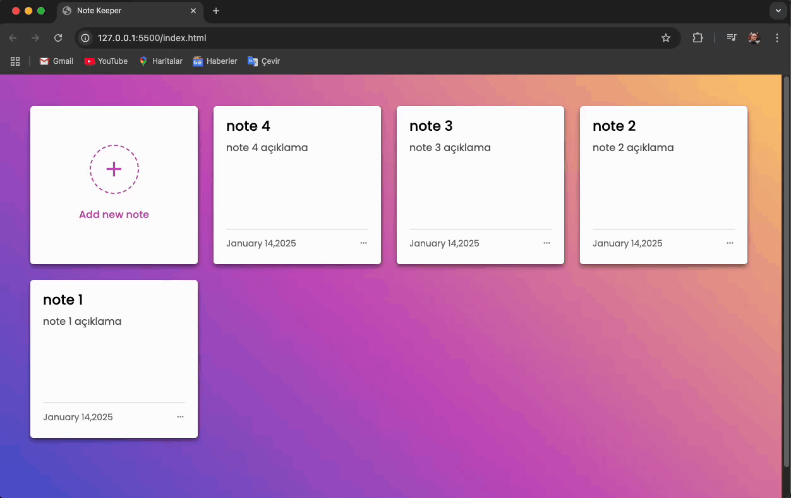

<h1>📝 Note Keeper Uygulaması</h1>

Bu proje, notlarınızı düzenli ve kolay bir şekilde tutmanıza olanak sağlayan, modern bir Note Keeper uygulamasıdır. Basit ama güçlü özelliklerle donatılmış bu uygulama, hem işlevsellik hem de estetik açısından kullanıcı dostu bir deneyim sunmayı hedefler.

<h2>🌟 Amaç</h2>

Bu proje, hem kişisel kullanım için pratik bir araç sağlarken hem de JavaScript ile dinamik web uygulamaları geliştirme yeteneğimi geliştirmeyi amaçlamaktadır.

<h2>🛠️ Kullanılan Teknolojiler</h2>

-Html
-Css
-JavaScript

<h2>⚙️ Özellikler</h2>

<h6>Tasarım:</h6>

Temiz ve Modern Arayüz: Minimalist bir tasarımla kullanıcıların ihtiyaç duyduğu işlevlere hızlıca erişmesini sağlar.

<h6>Kullanıcı Deneyimi:</h6>

Not Yönetimi: Yeni not ekleme, düzenleme ve silme işlemleri kolaylıkla yapılabilir.
Kullanıcı Dostu: Basit bir tasarım ve sezgisel arayüzle kullanıcıların deneyimi optimize edilmiştir.

<h1>🎬 Ekran Görüntüsü</h1>

